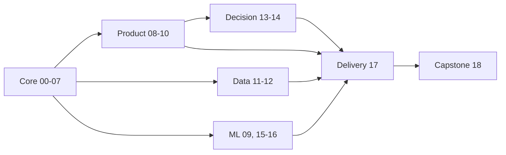

<!-- Generated from curriculum.json. Do not edit manually. -->

# Дорожная карта: Инструменты аналитика

**Версия:** 0.1.0  
**Полный маршрут:** ~238-326 часов

## Обзор

| Фаза | Название | Треки | Пререквизиты | Часы |
|---:|---|---|---|---:|
| 00 | [Вход и инструменты](phases/00-entry-and-tools) | core | - | 4-6 |
| 01 | [Воспроизводимый проект](phases/01-reproducible-project) | core | 00 | 8-10 |
| 02 | [NumPy и численные данные](phases/02-numpy) | core | 01 | 8-10 |
| 03 | [pandas и табличные данные](phases/03-pandas) | core | 02 | 14-18 |
| 04 | [SQL и DuckDB](phases/04-sql-and-duckdb) | core | 03 | 14-18 |
| 05 | [Источники и форматы данных](phases/05-sources-and-formats) | core | 04 | 10-14 |
| 06 | [EDA и визуальное мышление](phases/06-eda-and-visualization) | core | 05 | 12-16 |
| 07 | [Надежная аналитика](phases/07-reliable-analytics) | core | 06 | 10-14 |
| 08 | [Продуктовая аналитика](phases/08-product-analytics) | product | 07 | 12-16 |
| 09 | [Прикладная статистика](phases/09-applied-statistics) | product, ml | 07 | 12-16 |
| 10 | [Эксперименты](phases/10-experiments) | product | 08, 09 | 14-18 |
| 11 | [Analytics Engineering](phases/11-analytics-engineering) | data | 07 | 14-18 |
| 12 | [Производительность аналитики](phases/12-performance) | data, ml | 07 | 12-16 |
| 13 | [Причинный анализ](phases/13-causal-analysis) | decision, product | 09, 10 | 12-16 |
| 14 | [Временные ряды](phases/14-time-series) | decision | 09 | 12-16 |
| 15 | [Прикладное машинное обучение](phases/15-applied-machine-learning) | ml | 07, 09 | 16-20 |
| 16 | [Табличный ML и интерпретация](phases/16-tabular-ml) | ml | 15 | 12-16 |
| 17 | [Доставка аналитического результата](phases/17-delivery) | delivery | 07 | 12-18 |
| 18 | [Капстоун-проекты](phases/18-capstones) | core, product, data, decision, ml, delivery | 17 | 30-50 |

## Маршруты

- **Базовый аналитик**: `00-10 -> 17 -> 18` (~160-224 часов)
- **Продуктовый аналитик**: `00-10 -> 13 -> 17 -> 18` (~172-240 часов)
- **Analytics Engineer**: `00-07 -> 11-12 -> 17 -> 18` (~148-208 часов)
- **ML-аналитик**: `00-07 -> 09 -> 12 -> 15-18` (~174-242 часов)
- **Полный маршрут**: `00-18` (~238-326 часов)

## Граф зависимостей

## Фаза 00: Вход и инструменты

**Треки:** core  
**Пререквизиты:** Нет  
**Время:** ~4-6 часов  
**Итоговый артефакт:** Репозиторий первой аналитической задачи

| № | Урок | Статус |
|---:|---|---|
| 01 | [Карта профессии аналитика](phases/00-entry-and-tools/01-profession-map) | complete |
| 02 | [Диагностика Python и SQL](phases/00-entry-and-tools/02-python-and-sql-diagnostic) | complete |
| 03 | [Терминал и файловая система](phases/00-entry-and-tools/03-terminal-and-filesystem) | complete |
| 04 | [Git: история аналитического проекта](phases/00-entry-and-tools/04-git-foundations) | complete |
| 05 | [Ветки, pull request и ревью](phases/00-entry-and-tools/05-branches-and-review) | complete |
| 06 | [Секреты и безопасная работа с данными](phases/00-entry-and-tools/06-secrets-and-sensitive-data) | complete |

## Фаза 01: Воспроизводимый проект

**Треки:** core  
**Пререквизиты:** Фаза 00  
**Время:** ~8-10 часов  
**Итоговый артефакт:** Проект, запускаемый с нуля одной инструкцией

| № | Урок | Статус |
|---:|---|---|
| 01 | [Версии Python и совместимость](phases/01-reproducible-project/01-python-versions) | complete |
| 02 | [Окружения и зависимости с uv](phases/01-reproducible-project/02-uv-environments) | complete |
| 03 | [pyproject.toml как контракт проекта](phases/01-reproducible-project/03-pyproject) | complete |
| 04 | [Jupyter, kernels и состояние](phases/01-reproducible-project/04-jupyter-kernels) | complete |
| 05 | [Воспроизводимые ноутбуки](phases/01-reproducible-project/05-notebook-reproducibility) | complete |
| 06 | [От ноутбука к модулям и скриптам](phases/01-reproducible-project/06-modules-and-scripts) | complete |
| 07 | [Единый стиль и Ruff](phases/01-reproducible-project/07-ruff) | complete |
| 08 | [Первые проверки с pytest](phases/01-reproducible-project/08-pytest) | complete |
| 09 | [Автоматическая проверка в CI](phases/01-reproducible-project/09-continuous-integration) | complete |

## Фаза 02: NumPy и численные данные

**Треки:** core  
**Пререквизиты:** Фаза 01  
**Время:** ~8-10 часов  
**Итоговый артефакт:** Пакет проверенных функций для численных расчетов

| № | Урок | Статус |
|---:|---|---|
| 01 | ndarray и модель массива | designed |
| 02 | Shape, axes и размерность | designed |
| 03 | Dtype, память и диапазоны | designed |
| 04 | Индексация, срезы и маски | designed |
| 05 | Broadcasting без магии | designed |
| 06 | Агрегации и оси расчета | designed |
| 07 | Случайность и воспроизводимые симуляции | designed |
| 08 | Векторизация и производительность | designed |
| 09 | Численная точность и сравнение результатов | designed |

## Фаза 03: pandas и табличные данные

**Треки:** core  
**Пререквизиты:** Фаза 02  
**Время:** ~14-18 часов  
**Итоговый артефакт:** Витрина из нескольких грязных таблиц

| № | Урок | Статус |
|---:|---|---|
| 01 | DataFrame, Series и индексы | planned |
| 02 | Типы данных и пропуски | planned |
| 03 | Выбор строк и столбцов | planned |
| 04 | Преобразования без apply по умолчанию | planned |
| 05 | GroupBy и единица анализа | planned |
| 06 | Joins, ключи и cardinality | planned |
| 07 | Pivot, melt и tidy data | planned |
| 08 | Даты, интервалы и часовые пояса | planned |
| 09 | Строки и категориальные типы | planned |
| 10 | Method chaining и читаемые пайплайны | planned |
| 11 | Экспорт и передача результата | planned |

## Фаза 04: SQL и DuckDB

**Треки:** core  
**Пререквизиты:** Фаза 03  
**Время:** ~14-18 часов  
**Итоговый артефакт:** Набор проверенных SQL-витрин

| № | Урок | Статус |
|---:|---|---|
| 01 | Grain, ключи и связи | planned |
| 02 | SELECT и выражения | planned |
| 03 | NULL и трехзначная логика | planned |
| 04 | Агрегации и уровни детализации | planned |
| 05 | Joins без размножения метрик | planned |
| 06 | CTE и композиция запросов | planned |
| 07 | Оконные функции | planned |
| 08 | Время и даты в SQL | planned |
| 09 | Когорты на SQL | planned |
| 10 | DuckDB из Python | planned |
| 11 | Планы запросов и стоимость | planned |
| 12 | SQL или DataFrame: выбор инструмента | planned |

## Фаза 05: Источники и форматы данных

**Треки:** core  
**Пререквизиты:** Фаза 04  
**Время:** ~10-14 часов  
**Итоговый артефакт:** Устойчивый загрузчик внешних данных

| № | Урок | Статус |
|---:|---|---|
| 01 | CSV и неоднозначность типов | planned |
| 02 | Excel как источник и формат выдачи | planned |
| 03 | JSON и вложенные структуры | planned |
| 04 | HTTP и Requests | planned |
| 05 | Pagination, timeouts и retries | planned |
| 06 | HTML и Beautiful Soup | planned |
| 07 | Подключение к БД через SQLAlchemy | planned |
| 08 | Parquet и колоночное хранение | planned |
| 09 | Arrow как общий формат памяти | planned |
| 10 | Партиционирование наборов данных | planned |
| 11 | Кеширование и контроль целостности | planned |

## Фаза 06: EDA и визуальное мышление

**Треки:** core  
**Пререквизиты:** Фаза 05  
**Время:** ~12-16 часов  
**Итоговый артефакт:** Воспроизводимый EDA-отчет

| № | Урок | Статус |
|---:|---|---|
| 01 | Вопрос раньше графика | planned |
| 02 | Аудит набора данных | planned |
| 03 | Распределения и выбросы | planned |
| 04 | Связи между переменными | planned |
| 05 | Неопределенность на графике | planned |
| 06 | Matplotlib Object-Oriented API | planned |
| 07 | Статистическая визуализация с Seaborn | planned |
| 08 | Интерактивная визуализация с Plotly | planned |
| 09 | Altair и декларативная графика | planned |
| 10 | Дизайн, цвет и доступность | planned |
| 11 | От наблюдения к аналитическому выводу | planned |

## Фаза 07: Надежная аналитика

**Треки:** core  
**Пререквизиты:** Фаза 06  
**Время:** ~10-14 часов  
**Итоговый артефакт:** Пайплайн с тестами и контрактом данных

| № | Урок | Статус |
|---:|---|---|
| 01 | Инварианты аналитического расчета | planned |
| 02 | Unit tests для преобразований | planned |
| 03 | Fixtures и минимальные наборы данных | planned |
| 04 | Параметризация тестов | planned |
| 05 | Контракты DataFrame с Pandera | planned |
| 06 | Валидация конфигурации с Pydantic | planned |
| 07 | Проверки SQL-витрин | planned |
| 08 | Golden datasets и regression tests | planned |
| 09 | Логи, ошибки и диагностируемость | planned |
| 10 | Quality gates в CI | planned |

## Фаза 08: Продуктовая аналитика

**Треки:** product  
**Пререквизиты:** Фаза 07  
**Время:** ~12-16 часов  
**Итоговый артефакт:** Исследование продуктовой проблемы

| № | Урок | Статус |
|---:|---|---|
| 01 | Дерево метрик | planned |
| 02 | Событийная модель продукта | planned |
| 03 | Активность и активная аудитория | planned |
| 04 | Воронки и неоднозначность конверсии | planned |
| 05 | Когортный анализ | planned |
| 06 | Retention и возвращаемость | planned |
| 07 | Выручка, ARPU и LTV | planned |
| 08 | Сегментация без самообмана | planned |
| 09 | Guardrail-метрики | planned |
| 10 | Аномалии продуктовых метрик | planned |
| 11 | Бизнес-вывод и рекомендация | planned |

## Фаза 09: Прикладная статистика

**Треки:** product, ml  
**Пререквизиты:** Фаза 07  
**Время:** ~12-16 часов  
**Итоговый артефакт:** Статистический отчет с ограничениями

| № | Урок | Статус |
|---:|---|---|
| 01 | Популяция, выборка и механизм отбора | planned |
| 02 | Распределения как модели | planned |
| 03 | Оценки и свойства оценок | planned |
| 04 | Смещение и дисперсия | planned |
| 05 | Доверительные интервалы | planned |
| 06 | Bootstrap | planned |
| 07 | Корреляция и ложные связи | planned |
| 08 | Линейная регрессия для вывода | planned |
| 09 | Диагностика регрессии | planned |
| 10 | Робастные и непараметрические методы | planned |

## Фаза 10: Эксперименты

**Треки:** product  
**Пререквизиты:** Фаза 08, Фаза 09  
**Время:** ~14-18 часов  
**Итоговый артефакт:** Полный протокол A/B-эксперимента

| № | Урок | Статус |
|---:|---|---|
| 01 | Гипотеза и целевая метрика | planned |
| 02 | Единица рандомизации | planned |
| 03 | A/A-тест и Sample Ratio Mismatch | planned |
| 04 | MDE, мощность и размер выборки | planned |
| 05 | Сравнение средних и долей | planned |
| 06 | Bootstrap в экспериментах | planned |
| 07 | Снижение дисперсии и CUPED | planned |
| 08 | Множественные проверки | planned |
| 09 | Подглядывание и последовательный анализ | planned |
| 10 | Сегменты и неоднородные эффекты | planned |
| 11 | Протокол решения и коммуникация | planned |

## Фаза 11: Analytics Engineering

**Треки:** data  
**Пререквизиты:** Фаза 07  
**Время:** ~14-18 часов  
**Итоговый артефакт:** Документированная аналитическая витрина

| № | Урок | Статус |
|---:|---|---|
| 01 | Слои и контракты аналитических данных | planned |
| 02 | Структура dbt-проекта | planned |
| 03 | Sources, refs и зависимости | planned |
| 04 | Модели и materializations | planned |
| 05 | Data tests | planned |
| 06 | Jinja и macros без злоупотребления | planned |
| 07 | Инкрементальные модели | planned |
| 08 | Snapshots и история изменений | planned |
| 09 | Документация и lineage | planned |
| 10 | SQLFluff и единый стиль | planned |
| 11 | Локальный проект с dbt-duckdb | planned |

## Фаза 12: Производительность аналитики

**Треки:** data, ml  
**Пререквизиты:** Фаза 07  
**Время:** ~12-16 часов  
**Итоговый артефакт:** Бенчмарк одного пайплайна на нескольких движках

| № | Урок | Статус |
|---:|---|---|
| 01 | Корректный benchmarking | planned |
| 02 | CPU и memory profiling | planned |
| 03 | Память и типы данных | planned |
| 04 | Projection и predicate pushdown | planned |
| 05 | Arrow memory model | planned |
| 06 | DuckDB и данные больше памяти | planned |
| 07 | Polars expressions | planned |
| 08 | Lazy execution и оптимизация | planned |
| 09 | Streaming и пакетная обработка | planned |
| 10 | Обмен между pandas, Arrow и Polars | planned |
| 11 | Ibis как переносимый DataFrame API | planned |

## Фаза 13: Причинный анализ

**Треки:** decision, product  
**Пререквизиты:** Фаза 09, Фаза 10  
**Время:** ~12-16 часов  
**Итоговый артефакт:** Причинное исследование с явными assumptions

| № | Урок | Статус |
|---:|---|---|
| 01 | Корреляция и причинность | planned |
| 02 | Причинные DAG | planned |
| 03 | Confounders и backdoor paths | planned |
| 04 | Colliders и selection bias | planned |
| 05 | Regression adjustment | planned |
| 06 | Matching | planned |
| 07 | Propensity weighting | planned |
| 08 | Difference-in-Differences | planned |
| 09 | RDD и instrumental variables: обзор | planned |
| 10 | Sensitivity analysis | planned |
| 11 | DoWhy и EconML: границы автоматизации | planned |

## Фаза 14: Временные ряды

**Треки:** decision  
**Пререквизиты:** Фаза 09  
**Время:** ~12-16 часов  
**Итоговый артефакт:** Прогноз с корректным backtesting

| № | Урок | Статус |
|---:|---|---|
| 01 | Временной индекс и частота | planned |
| 02 | Resampling и агрегация | planned |
| 03 | Rolling и expanding windows | planned |
| 04 | Тренд и сезонность | planned |
| 05 | Временная утечка | planned |
| 06 | Наивные и сезонные baseline | planned |
| 07 | Декомпозиция ряда | planned |
| 08 | ETS и ARIMA | planned |
| 09 | Rolling backtesting | planned |
| 10 | Метрики прогноза | planned |
| 11 | Интервалы прогноза | planned |
| 12 | Аномалии временных рядов | planned |

## Фаза 15: Прикладное машинное обучение

**Треки:** ml  
**Пререквизиты:** Фаза 07, Фаза 09  
**Время:** ~16-20 часов  
**Итоговый артефакт:** Воспроизводимый ML baseline и model card

| № | Урок | Статус |
|---:|---|---|
| 01 | Постановка ML-задачи | planned |
| 02 | Train, validation и test | planned |
| 03 | Метрики и стоимость ошибки | planned |
| 04 | Предобработка как часть модели | planned |
| 05 | scikit-learn Pipeline | planned |
| 06 | ColumnTransformer | planned |
| 07 | Линейные baseline | planned |
| 08 | Деревья решений | planned |
| 09 | Ансамбли деревьев | planned |
| 10 | Cross-validation | planned |
| 11 | Несбалансированные классы | planned |
| 12 | Калибровка вероятностей | planned |
| 13 | Data leakage | planned |
| 14 | Анализ ошибок по сегментам | planned |
| 15 | Model card и ограничения | planned |

## Фаза 16: Табличный ML и интерпретация

**Треки:** ml  
**Пререквизиты:** Фаза 15  
**Время:** ~12-16 часов  
**Итоговый артефакт:** Модель и интерпретационный отчет

| № | Урок | Статус |
|---:|---|---|
| 01 | CatBoost как сильный табличный baseline | planned |
| 02 | Категориальные признаки без leakage | planned |
| 03 | Early stopping | planned |
| 04 | Встроенная важность признаков | planned |
| 05 | Permutation importance | planned |
| 06 | SHAP и ограничения объяснений | planned |
| 07 | Сегментный анализ модели | planned |
| 08 | Порог и стоимость решения | planned |
| 09 | Optuna и честный подбор параметров | planned |
| 10 | MLflow для истории экспериментов | planned |
| 11 | Drift и стабильность | planned |

## Фаза 17: Доставка аналитического результата

**Треки:** delivery  
**Пререквизиты:** Фаза 07  
**Время:** ~12-18 часов  
**Итоговый артефакт:** Аналитический продукт для заказчика

| № | Урок | Статус |
|---:|---|---|
| 01 | Аналитическая записка | planned |
| 02 | Excel и XlsxWriter | planned |
| 03 | Воспроизводимые отчеты с Quarto | planned |
| 04 | HTML, PDF и DOCX | planned |
| 05 | Интерактивный отчет Plotly | planned |
| 06 | Приложение на Streamlit | planned |
| 07 | Кеширование и состояние приложения | planned |
| 08 | CLI для повторяемого запуска | planned |
| 09 | Запуски по расписанию | planned |
| 10 | FastAPI как факультативный интерфейс | planned |
| 11 | Docker как факультативная упаковка | planned |
| 12 | Handoff, документация и сопровождение | planned |

## Фаза 18: Капстоун-проекты

**Треки:** core, product, data, decision, ml, delivery  
**Пререквизиты:** Фаза 17  
**Время:** ~30-50 часов  
**Итоговый артефакт:** Завершенный портфельный проект

| № | Урок | Статус |
|---:|---|---|
| 01 | Выбор и ограничение задачи | planned |
| 02 | Контракт и аудит данных | planned |
| 03 | Baseline результата | planned |
| 04 | Реализация проекта | planned |
| 05 | Проверки и независимая валидация | planned |
| 06 | Peer review | planned |
| 07 | Защита решения | planned |
