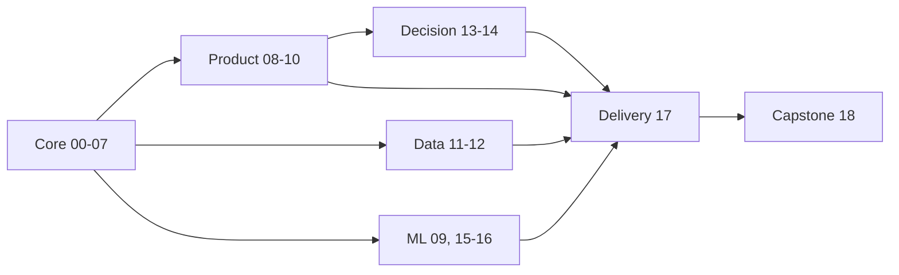

<!-- Generated from curriculum.json. Do not edit manually. -->

# Дорожная карта: Инструменты аналитика

**Версия:** 0.1.0  
**Полный маршрут:** ~237-325 часов

## Обзор

| Фаза | Название | Треки | Пререквизиты | Часы |
|---:|---|---|---|---:|
| 00 | [Вход и инструменты](phases/00-entry-and-tools) | core | - | 4-6 |
| 01 | [Воспроизводимый проект](phases/01-reproducible-project) | core | 00 | 7-8 |
| 02 | [NumPy и численные данные](phases/02-numpy) | core | 01 | 8-11 |
| 03 | [pandas и табличные данные](phases/03-pandas) | core | 02 | 14-18 |
| 04 | [SQL и DuckDB](phases/04-sql-and-duckdb) | core | 03 | 14-18 |
| 05 | [Источники и форматы данных](phases/05-sources-and-formats) | core | 04 | 10-14 |
| 06 | [EDA и визуальное мышление](phases/06-eda-and-visualization) | core | 05 | 12-16 |
| 07 | [Надежная аналитика](phases/07-reliable-analytics) | core | 06 | 10-14 |
| 08 | [Продуктовая аналитика](phases/08-product-analytics) | product | 07 | 12-16 |
| 09 | [Прикладная статистика](phases/09-applied-statistics) | product, ml | 07 | 12-16 |
| 10 | [Эксперименты](phases/10-experiments) | product | 08, 09 | 14-18 |
| 11 | [Analytics Engineering](phases/11-analytics-engineering) | data | 07 | 14-18 |
| 12 | [Производительность аналитики](phases/12-performance) | data, ml | 07 | 12-16 |
| 13 | [Причинный анализ](phases/13-causal-analysis) | decision, product | 09, 10 | 12-16 |
| 14 | [Временные ряды](phases/14-time-series) | decision | 08, 09 | 12-16 |
| 15 | [Прикладное машинное обучение](phases/15-applied-machine-learning) | ml | 07, 09 | 16-20 |
| 16 | [Табличный ML и интерпретация](phases/16-tabular-ml) | ml | 15 | 12-16 |
| 17 | [Доставка аналитического результата](phases/17-delivery) | delivery | 07 | 12-18 |
| 18 | [Капстоун-проекты](phases/18-capstones) | core, product, data, decision, ml, delivery | 17 | 30-50 |

## Маршруты

- **Аналитик данных**: `00-10 -> 17 -> 18` (~159-223 часов)
- **Продуктовый аналитик**: `00-10 -> 13 -> 17 -> 18` (~171-239 часов)
- **Аналитик временных рядов**: `00-09 -> 14 -> 17 -> 18` (~157-221 часов)
- **Analytics Engineer**: `00-07 -> 11-12 -> 17 -> 18` (~147-207 часов)
- **ML-аналитик**: `00-07 -> 09 -> 12 -> 15-18` (~173-241 часов)
- **Полный маршрут**: `00-18` (~237-325 часов)

## Граф зависимостей

## Фаза 00: Вход и инструменты

- **Треки:** core
- **Пререквизиты:** Нет
- **Время:** ~4-6 часов
- **Итоговый артефакт:** Репозиторий первой аналитической задачи

| № | Урок | Статус |
|---:|---|---|
| 01 | [Терминал и файловая система](phases/00-entry-and-tools/01-terminal-and-filesystem) | complete |
| 02 | [Git: история аналитического проекта](phases/00-entry-and-tools/02-git-foundations) | complete |
| 03 | [Ветки, pull request и ревью](phases/00-entry-and-tools/03-branches-and-review) | complete |
| 04 | [Секреты и безопасная работа с данными](phases/00-entry-and-tools/04-secrets-and-sensitive-data) | complete |

## Фаза 01: Воспроизводимый проект

- **Треки:** core
- **Пререквизиты:** Фаза 00
- **Время:** ~7-8 часов
- **Итоговый артефакт:** Проект, запускаемый с нуля одной инструкцией

| № | Урок | Статус |
|---:|---|---|
| 01 | [Окружения и зависимости с uv](phases/01-reproducible-project/01-uv-environments) | complete |
| 02 | [Jupyter, kernels и состояние](phases/01-reproducible-project/02-jupyter-kernels) | complete |
| 03 | [Воспроизводимые ноутбуки](phases/01-reproducible-project/03-notebook-reproducibility) | complete |
| 04 | [От ноутбука к модулям и скриптам](phases/01-reproducible-project/04-modules-and-scripts) | complete |
| 05 | [Единый стиль и Ruff](phases/01-reproducible-project/05-ruff) | complete |
| 06 | [Первые проверки с pytest](phases/01-reproducible-project/06-pytest) | complete |
| 07 | [Автоматическая проверка в CI](phases/01-reproducible-project/07-continuous-integration) | complete |

## Фаза 02: NumPy и численные данные

- **Треки:** core
- **Пререквизиты:** Фаза 01
- **Время:** ~8-11 часов
- **Итоговый артефакт:** Пакет проверенных функций для численных расчетов

| № | Урок | Статус |
|---:|---|---|
| 01 | [ndarray: модель числового массива](phases/02-numpy/01-arrays) | complete |
| 02 | [Shape, axes и размерность](phases/02-numpy/02-shape-and-axes) | complete |
| 03 | [Dtype, память и диапазоны](phases/02-numpy/03-dtypes) | complete |
| 04 | [Индексация, срезы и маски](phases/02-numpy/04-indexing-and-masks) | complete |
| 05 | [Broadcasting без магии](phases/02-numpy/05-broadcasting) | complete |
| 06 | [Агрегации и оси расчета](phases/02-numpy/06-aggregations) | complete |
| 07 | [Случайность и воспроизводимые симуляции](phases/02-numpy/07-random-simulations) | complete |
| 08 | [Векторизация и производительность](phases/02-numpy/08-vectorization) | complete |
| 09 | [Численная точность и сравнение результатов](phases/02-numpy/09-numerical-precision) | complete |

## Фаза 03: pandas и табличные данные

- **Треки:** core
- **Пререквизиты:** Фаза 02
- **Время:** ~14-18 часов
- **Итоговый артефакт:** Витрина из нескольких грязных таблиц

| № | Урок | Статус |
|---:|---|---|
| 01 | [DataFrame, Series и индексы](phases/03-pandas/01-dataframe-and-series) | complete |
| 02 | [Типы данных и пропуски](phases/03-pandas/02-types-and-missing-values) | complete |
| 03 | [Выбор строк и столбцов](phases/03-pandas/03-selection-and-filtering) | complete |
| 04 | [Преобразования без apply по умолчанию](phases/03-pandas/04-transformations) | complete |
| 05 | [GroupBy и единица анализа](phases/03-pandas/05-groupby) | complete |
| 06 | [Joins, ключи и cardinality](phases/03-pandas/06-joins-and-cardinality) | complete |
| 07 | [Pivot, melt и tidy data](phases/03-pandas/07-reshape) | complete |
| 08 | [Даты, интервалы и часовые пояса](phases/03-pandas/08-dates-and-timezones) | complete |
| 09 | [Строки и категориальные типы](phases/03-pandas/09-strings-and-categories) | complete |
| 10 | [Method chaining и читаемые пайплайны](phases/03-pandas/10-method-chaining) | complete |
| 11 | [Экспорт и передача результата](phases/03-pandas/11-export-and-handoff) | complete |

## Фаза 04: SQL и DuckDB

- **Треки:** core
- **Пререквизиты:** Фаза 03
- **Время:** ~14-18 часов
- **Итоговый артефакт:** Набор проверенных SQL-витрин

| № | Урок | Статус |
|---:|---|---|
| 01 | [Grain, ключи и связи](phases/04-sql-and-duckdb/01-grain-keys-relations) | complete |
| 02 | [SELECT и выражения](phases/04-sql-and-duckdb/02-select-and-expressions) | complete |
| 03 | [NULL и трехзначная логика](phases/04-sql-and-duckdb/03-null-semantics) | complete |
| 04 | [Агрегации и уровни детализации](phases/04-sql-and-duckdb/04-aggregations) | complete |
| 05 | [Joins без размножения метрик](phases/04-sql-and-duckdb/05-joins) | complete |
| 06 | [CTE и композиция запросов](phases/04-sql-and-duckdb/06-cte-and-subqueries) | complete |
| 07 | [Оконные функции](phases/04-sql-and-duckdb/07-window-functions) | complete |
| 08 | [Время и даты в SQL](phases/04-sql-and-duckdb/08-dates) | complete |
| 09 | [Когорты на SQL](phases/04-sql-and-duckdb/09-cohorts) | complete |
| 10 | [DuckDB из Python](phases/04-sql-and-duckdb/10-duckdb-python) | complete |
| 11 | [Планы запросов и стоимость](phases/04-sql-and-duckdb/11-query-plans) | complete |
| 12 | [SQL или DataFrame: выбор инструмента](phases/04-sql-and-duckdb/12-sql-vs-dataframes) | complete |

## Фаза 05: Источники и форматы данных

- **Треки:** core
- **Пререквизиты:** Фаза 04
- **Время:** ~10-14 часов
- **Итоговый артефакт:** Устойчивый загрузчик внешних данных

| № | Урок | Статус |
|---:|---|---|
| 01 | [CSV и неоднозначность типов](phases/05-sources-and-formats/01-csv) | complete |
| 02 | [Excel как источник: листы, диапазоны и формулы](phases/05-sources-and-formats/02-excel) | complete |
| 03 | [JSON и вложенные структуры](phases/05-sources-and-formats/03-json) | complete |
| 04 | [HTTP и Requests](phases/05-sources-and-formats/04-http-requests) | complete |
| 05 | [Pagination, timeouts и retries](phases/05-sources-and-formats/05-pagination-retries) | complete |
| 06 | [HTML и Beautiful Soup](phases/05-sources-and-formats/06-html-parsing) | complete |
| 07 | [Подключение к БД через SQLAlchemy](phases/05-sources-and-formats/07-sqlalchemy) | complete |
| 08 | [Parquet и колоночное хранение](phases/05-sources-and-formats/08-parquet) | complete |
| 09 | [Arrow как контракт обмена таблицами](phases/05-sources-and-formats/09-arrow) | complete |
| 10 | [Партиционирование наборов данных](phases/05-sources-and-formats/10-partitioning) | complete |
| 11 | [Кеширование и контроль целостности](phases/05-sources-and-formats/11-caching-and-checksums) | complete |

## Фаза 06: EDA и визуальное мышление

- **Треки:** core
- **Пререквизиты:** Фаза 05
- **Время:** ~12-16 часов
- **Итоговый артефакт:** Воспроизводимый EDA-отчет

| № | Урок | Статус |
|---:|---|---|
| 01 | [Вопрос раньше графика](phases/06-eda-and-visualization/01-question-before-chart) | complete |
| 02 | [Аудит набора данных](phases/06-eda-and-visualization/02-data-audit) | complete |
| 03 | [Воспроизводимая фигура с Matplotlib](phases/06-eda-and-visualization/03-matplotlib-oo) | complete |
| 04 | [Распределения и выбросы](phases/06-eda-and-visualization/04-distributions) | complete |
| 05 | [Связи между переменными](phases/06-eda-and-visualization/05-relationships) | complete |
| 06 | [Неопределенность на графике](phases/06-eda-and-visualization/06-uncertainty) | complete |
| 07 | [Статистические сравнения с Seaborn](phases/06-eda-and-visualization/07-seaborn) | complete |
| 08 | [Интерактивный drill-down с Plotly](phases/06-eda-and-visualization/08-plotly) | complete |
| 09 | [Декларативная спецификация с Altair](phases/06-eda-and-visualization/09-altair) | complete |
| 10 | [Дизайн, цвет и доступность](phases/06-eda-and-visualization/10-design-and-accessibility) | complete |
| 11 | [От наблюдения к аналитическому выводу](phases/06-eda-and-visualization/11-analytical-conclusion) | complete |

## Фаза 07: Надежная аналитика

- **Треки:** core
- **Пререквизиты:** Фаза 06
- **Время:** ~10-14 часов
- **Итоговый артефакт:** Пайплайн с тестами и контрактом данных

| № | Урок | Статус |
|---:|---|---|
| 01 | [Инварианты аналитического расчета](phases/07-reliable-analytics/01-invariants) | complete |
| 02 | [Тесты на границах преобразований](phases/07-reliable-analytics/02-unit-tests) | complete |
| 03 | [Минимальные контрпримеры и матрица дефектов](phases/07-reliable-analytics/03-defect-matrix) | complete |
| 04 | [Property-based testing с Hypothesis](phases/07-reliable-analytics/04-property-based-testing) | complete |
| 05 | [Контракты DataFrame с Pandera](phases/07-reliable-analytics/05-pandera) | complete |
| 06 | [Валидация конфигурации с Pydantic](phases/07-reliable-analytics/06-pydantic) | complete |
| 07 | [Проверки SQL-витрин](phases/07-reliable-analytics/07-sql-checks) | complete |
| 08 | [Golden datasets и regression tests](phases/07-reliable-analytics/08-golden-datasets) | complete |
| 09 | [Наблюдаемость и мониторинг качества данных](phases/07-reliable-analytics/09-observability) | complete |
| 10 | [Интеграционный quality gate](phases/07-reliable-analytics/10-quality-gates) | complete |

## Фаза 08: Продуктовая аналитика

- **Треки:** product
- **Пререквизиты:** Фаза 07
- **Время:** ~12-16 часов
- **Итоговый артефакт:** Исследование продуктовой проблемы

| № | Урок | Статус |
|---:|---|---|
| 01 | [Дерево метрик](phases/08-product-analytics/01-metric-tree) | complete |
| 02 | [Событийная модель продукта](phases/08-product-analytics/02-event-model) | complete |
| 03 | [Активность и активная аудитория](phases/08-product-analytics/03-activity) | complete |
| 04 | [Воронки и неоднозначность конверсии](phases/08-product-analytics/04-funnels) | complete |
| 05 | [Когортный анализ](phases/08-product-analytics/05-cohorts) | complete |
| 06 | [Retention и возвращаемость](phases/08-product-analytics/06-retention) | complete |
| 07 | [Выручка, ARPU и LTV](phases/08-product-analytics/07-monetization) | complete |
| 08 | [Сегментация без самообмана](phases/08-product-analytics/08-segmentation) | complete |
| 09 | [Guardrail-метрики](phases/08-product-analytics/09-guardrails) | complete |
| 10 | [Аномалии продуктовых метрик](phases/08-product-analytics/10-anomalies) | complete |
| 11 | [Бизнес-вывод и рекомендация](phases/08-product-analytics/11-business-conclusion) | complete |

## Фаза 09: Прикладная статистика

- **Треки:** product, ml
- **Пререквизиты:** Фаза 07
- **Время:** ~12-16 часов
- **Итоговый артефакт:** Статистический отчет с ограничениями

| № | Урок | Статус |
|---:|---|---|
| 01 | [Популяция, выборка и механизм отбора](phases/09-applied-statistics/01-population-and-sample) | complete |
| 02 | [Распределения как модели](phases/09-applied-statistics/02-distributions) | complete |
| 03 | [Оценки и свойства оценок](phases/09-applied-statistics/03-estimators) | complete |
| 04 | [Смещение и дисперсия](phases/09-applied-statistics/04-bias-and-variance) | complete |
| 05 | [Доверительные интервалы](phases/09-applied-statistics/05-confidence-intervals) | complete |
| 06 | [Bootstrap](phases/09-applied-statistics/06-bootstrap) | complete |
| 07 | [Корреляция и ложные связи](phases/09-applied-statistics/07-correlation) | complete |
| 08 | [Линейная регрессия для вывода](phases/09-applied-statistics/08-linear-regression) | complete |
| 09 | [Диагностика регрессии](phases/09-applied-statistics/09-regression-diagnostics) | complete |
| 10 | [Робастные и непараметрические методы](phases/09-applied-statistics/10-robust-methods) | complete |

## Фаза 10: Эксперименты

- **Треки:** product
- **Пререквизиты:** Фаза 08, Фаза 09
- **Время:** ~14-18 часов
- **Итоговый артефакт:** Полный протокол A/B-эксперимента

| № | Урок | Статус |
|---:|---|---|
| 01 | [Гипотеза и целевая метрика](phases/10-experiments/01-hypothesis-and-metric) | complete |
| 02 | [Единица рандомизации](phases/10-experiments/02-randomization-unit) | complete |
| 03 | [A/A-тест и Sample Ratio Mismatch](phases/10-experiments/03-aa-and-srm) | complete |
| 04 | [MDE, мощность и размер выборки](phases/10-experiments/04-mde-and-power) | complete |
| 05 | [Сравнение средних и долей](phases/10-experiments/05-means-and-proportions) | complete |
| 06 | [Bootstrap в экспериментах](phases/10-experiments/06-bootstrap) | complete |
| 07 | [Снижение дисперсии и CUPED](phases/10-experiments/07-cuped) | complete |
| 08 | [Множественные проверки](phases/10-experiments/08-multiple-testing) | complete |
| 09 | [Подглядывание и последовательный анализ](phases/10-experiments/09-peeking) | complete |
| 10 | [Сегменты и неоднородные эффекты](phases/10-experiments/10-heterogeneous-effects) | complete |
| 11 | [Протокол решения и коммуникация](phases/10-experiments/11-decision-protocol) | complete |

## Фаза 11: Analytics Engineering

- **Треки:** data
- **Пререквизиты:** Фаза 07
- **Время:** ~14-18 часов
- **Итоговый артефакт:** Документированная аналитическая витрина

| № | Урок | Статус |
|---:|---|---|
| 01 | [Слои и контракты аналитических данных](phases/11-analytics-engineering/01-data-layers) | complete |
| 02 | [Структура dbt-проекта](phases/11-analytics-engineering/02-dbt-project) | complete |
| 03 | [Sources, refs и зависимости](phases/11-analytics-engineering/03-sources-and-refs) | complete |
| 04 | [Модели и materializations](phases/11-analytics-engineering/04-models) | complete |
| 05 | [Data tests](phases/11-analytics-engineering/05-data-tests) | complete |
| 06 | [Jinja и macros без злоупотребления](phases/11-analytics-engineering/06-macros) | complete |
| 07 | [Инкрементальные модели](phases/11-analytics-engineering/07-incremental-models) | complete |
| 08 | [Snapshots и история изменений](phases/11-analytics-engineering/08-snapshots) | complete |
| 09 | [Документация и lineage](phases/11-analytics-engineering/09-documentation-and-lineage) | complete |
| 10 | [SQLFluff и единый стиль](phases/11-analytics-engineering/10-sqlfluff) | complete |
| 11 | [Локальный проект с dbt-duckdb](phases/11-analytics-engineering/11-dbt-duckdb-project) | complete |

## Фаза 12: Производительность аналитики

- **Треки:** data, ml
- **Пререквизиты:** Фаза 07
- **Время:** ~12-16 часов
- **Итоговый артефакт:** Бенчмарк одного пайплайна на нескольких движках

| № | Урок | Статус |
|---:|---|---|
| 01 | [Корректный benchmarking](phases/12-performance/01-benchmarking) | complete |
| 02 | [CPU и memory profiling](phases/12-performance/02-profiling) | complete |
| 03 | [Память и типы данных](phases/12-performance/03-memory-and-dtypes) | complete |
| 04 | [Projection и predicate pushdown](phases/12-performance/04-parquet-pushdown) | complete |
| 05 | [Arrow memory model](phases/12-performance/05-arrow-memory) | complete |
| 06 | [DuckDB и данные больше памяти](phases/12-performance/06-duckdb-out-of-core) | complete |
| 07 | [Polars expressions](phases/12-performance/07-polars-expressions) | complete |
| 08 | [Lazy execution и оптимизация](phases/12-performance/08-lazy-execution) | complete |
| 09 | [Streaming и пакетная обработка](phases/12-performance/09-streaming) | complete |
| 10 | [Обмен между pandas, Arrow и Polars](phases/12-performance/10-interoperability) | complete |
| 11 | [Ibis как переносимый DataFrame API](phases/12-performance/11-ibis) | complete |

## Фаза 13: Причинный анализ

- **Треки:** decision, product
- **Пререквизиты:** Фаза 09, Фаза 10
- **Время:** ~12-16 часов
- **Итоговый артефакт:** Воспроизводимый causal-study-package с DAG, идентификацией, оценками и sensitivity checks

| № | Урок | Статус |
|---:|---|---|
| 01 | [Причинный вопрос и estimand](phases/13-causal-analysis/01-causal-question-and-estimand) | complete |
| 02 | [Причинные DAG и идентификация](phases/13-causal-analysis/02-causal-dags) | complete |
| 03 | [Confounders и backdoor adjustment](phases/13-causal-analysis/03-confounders) | complete |
| 04 | [Colliders, mediators и selection bias](phases/13-causal-analysis/04-colliders) | complete |
| 05 | [Regression adjustment и g-formula](phases/13-causal-analysis/05-regression-adjustment) | complete |
| 06 | [Matching и баланс ковариат](phases/13-causal-analysis/06-matching) | complete |
| 07 | [Propensity weighting и doubly robust оценка](phases/13-causal-analysis/07-weighting-and-doubly-robust) | complete |
| 08 | [Difference-in-Differences](phases/13-causal-analysis/08-difference-in-differences) | complete |
| 09 | [RDD и instrumental variables: дизайн до оценки](phases/13-causal-analysis/09-quasi-experiments) | complete |
| 10 | [Sensitivity analysis и falsification checks](phases/13-causal-analysis/10-sensitivity) | complete |
| 11 | [Causal workflow и границы автоматизации](phases/13-causal-analysis/11-causal-workflow) | complete |

## Фаза 14: Временные ряды

- **Треки:** decision
- **Пререквизиты:** Фаза 08, Фаза 09
- **Время:** ~12-16 часов
- **Итоговый артефакт:** Time-series forecast package с backtesting, интервалами и anomaly policy

| № | Урок | Статус |
|---:|---|---|
| 01 | [Временной индекс, частота и календарный grain](phases/14-time-series/01-time-index) | complete |
| 02 | [Resampling и агрегация](phases/14-time-series/02-resampling) | complete |
| 03 | [Rolling и expanding windows](phases/14-time-series/03-rolling) | complete |
| 04 | [Тренд, сезонность и календарные эффекты](phases/14-time-series/04-trend-and-seasonality) | complete |
| 05 | [Временная утечка](phases/14-time-series/05-temporal-leakage) | complete |
| 06 | [Наивные и сезонные baseline](phases/14-time-series/06-forecast-baselines) | complete |
| 07 | [Декомпозиция ряда](phases/14-time-series/07-decomposition) | complete |
| 08 | [ETS и ARIMA](phases/14-time-series/08-ets-and-arima) | complete |
| 09 | [Rolling backtesting](phases/14-time-series/09-backtesting) | complete |
| 10 | [Метрики прогноза](phases/14-time-series/10-forecast-metrics) | complete |
| 11 | [Интервалы прогноза](phases/14-time-series/11-prediction-intervals) | complete |
| 12 | [Аномалии временных рядов и forecast package](phases/14-time-series/12-time-series-anomalies) | complete |

## Фаза 15: Прикладное машинное обучение

- **Треки:** ml
- **Пререквизиты:** Фаза 07, Фаза 09
- **Время:** ~16-20 часов
- **Итоговый артефакт:** Воспроизводимый ML baseline и model card

| № | Урок | Статус |
|---:|---|---|
| 01 | [Постановка ML-задачи](phases/15-applied-machine-learning/01-problem-framing) | complete |
| 02 | [Train, validation и test](phases/15-applied-machine-learning/02-data-splitting) | complete |
| 03 | [Метрики и стоимость ошибки](phases/15-applied-machine-learning/03-metrics) | complete |
| 04 | [Предобработка как часть модели](phases/15-applied-machine-learning/04-preprocessing) | complete |
| 05 | [scikit-learn Pipeline](phases/15-applied-machine-learning/05-pipeline) | complete |
| 06 | [ColumnTransformer](phases/15-applied-machine-learning/06-column-transformer) | complete |
| 07 | [Линейные baseline](phases/15-applied-machine-learning/07-linear-models) | complete |
| 08 | [Деревья решений](phases/15-applied-machine-learning/08-trees) | complete |
| 09 | [Ансамбли деревьев](phases/15-applied-machine-learning/09-ensembles) | complete |
| 10 | [Cross-validation](phases/15-applied-machine-learning/10-cross-validation) | complete |
| 11 | [Несбалансированные классы](phases/15-applied-machine-learning/11-imbalanced-data) | complete |
| 12 | [Калибровка вероятностей](phases/15-applied-machine-learning/12-calibration) | complete |
| 13 | [Data leakage](phases/15-applied-machine-learning/13-leakage) | complete |
| 14 | [Анализ ошибок по сегментам](phases/15-applied-machine-learning/14-error-analysis) | complete |
| 15 | [Model card и ограничения](phases/15-applied-machine-learning/15-model-card) | complete |

## Фаза 16: Табличный ML и интерпретация

- **Треки:** ml
- **Пререквизиты:** Фаза 15
- **Время:** ~12-16 часов
- **Итоговый артефакт:** Tabular ML interpretation package

| № | Урок | Статус |
|---:|---|---|
| 01 | [CatBoost как сильный табличный baseline](phases/16-tabular-ml/01-catboost) | complete |
| 02 | [Категориальные признаки без leakage](phases/16-tabular-ml/02-categorical-features) | complete |
| 03 | [Early stopping и iteration budget](phases/16-tabular-ml/03-early-stopping) | complete |
| 04 | [Встроенная важность признаков](phases/16-tabular-ml/04-feature-importance) | complete |
| 05 | [Permutation importance](phases/16-tabular-ml/05-permutation-importance) | complete |
| 06 | [SHAP и ограничения объяснений](phases/16-tabular-ml/06-shap) | complete |
| 07 | [Сегментный анализ сильной модели](phases/16-tabular-ml/07-segment-analysis) | complete |
| 08 | [Порог и стоимость решения для сильной модели](phases/16-tabular-ml/08-cost-sensitive-decisions) | complete |
| 09 | [Optuna и честный подбор параметров](phases/16-tabular-ml/09-optuna) | complete |
| 10 | [MLflow для истории экспериментов](phases/16-tabular-ml/10-mlflow) | complete |
| 11 | [Drift, стабильность и interpretation package](phases/16-tabular-ml/11-drift-and-stability) | complete |

## Фаза 17: Доставка аналитического результата

- **Треки:** delivery
- **Пререквизиты:** Фаза 07
- **Время:** ~12-18 часов
- **Итоговый артефакт:** Stakeholder delivery package

| № | Урок | Статус |
|---:|---|---|
| 01 | [Аналитическая записка для решения](phases/17-delivery/01-analytical-memo) | complete |
| 02 | [Excel и XlsxWriter для stakeholder workbook](phases/17-delivery/02-excel-xlsxwriter) | complete |
| 03 | [Воспроизводимые отчеты с Quarto](phases/17-delivery/03-quarto) | complete |
| 04 | [HTML, PDF и DOCX как delivery formats](phases/17-delivery/04-document-formats) | complete |
| 05 | [Интерактивный отчет Plotly](phases/17-delivery/05-interactive-plotly) | complete |
| 06 | [Приложение на Streamlit](phases/17-delivery/06-streamlit) | complete |
| 07 | [Кеширование, состояние и свежесть приложения](phases/17-delivery/07-caching-and-state) | complete |
| 08 | [CLI для повторяемого запуска](phases/17-delivery/08-cli) | complete |
| 09 | [Запуски по расписанию и freshness report](phases/17-delivery/09-scheduled-runs) | complete |
| 10 | [FastAPI как факультативный интерфейс](phases/17-delivery/10-fastapi) | complete |
| 11 | [Docker как факультативная упаковка](phases/17-delivery/11-docker) | complete |
| 12 | [Handoff, документация и сопровождение](phases/17-delivery/12-handoff) | complete |

## Фаза 18: Капстоун-проекты

- **Треки:** core, product, data, decision, ml, delivery
- **Пререквизиты:** Фаза 17
- **Время:** ~30-50 часов
- **Итоговый артефакт:** Capstone portfolio package

| № | Урок | Статус |
|---:|---|---|
| 01 | [Выбор и ограничение задачи](phases/18-capstones/01-problem-selection) | complete |
| 02 | [Контракт и аудит данных](phases/18-capstones/02-data-contract) | complete |
| 03 | [Baseline результата](phases/18-capstones/03-baseline) | complete |
| 04 | [Реализация проекта](phases/18-capstones/04-implementation) | complete |
| 05 | [Проверки и независимая валидация](phases/18-capstones/05-verification) | complete |
| 06 | [Peer review](phases/18-capstones/06-peer-review) | complete |
| 07 | [Защита решения](phases/18-capstones/07-defense) | complete |
