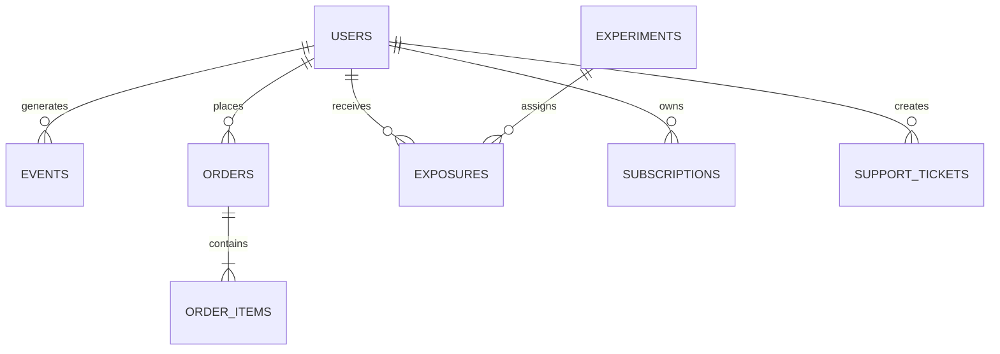

# Учебная предметная область

Курс использует вымышленный подписочный сервис с маркетплейсом дополнительных товаров.
Это позволяет связать продуктовые события, платежи, эксперименты, поддержку и ML-задачи
без использования персональных или коммерчески чувствительных данных.

## Основные сущности

| Таблица | Grain | Основной ключ |
|---|---|---|
| `users` | один пользователь | `user_id` |
| `events` | одно событие клиента | `event_id` |
| `orders` | один заказ | `order_id` |
| `order_items` | одна товарная позиция заказа | `order_id, product_id` |
| `subscriptions` | один период подписки | `subscription_id` |
| `experiments` | один эксперимент | `experiment_id` |
| `exposures` | назначение пользователя в эксперимент | `experiment_id, user_id` |
| `support_tickets` | одно обращение | `ticket_id` |

## Планируемые дефекты

Данные намеренно не должны быть идеальными:

- повторная доставка событий;
- поздние события и разные часовые пояса;
- платежи в нескольких валютах;
- удаленные пользователи;
- изменение схемы JSON;
- пропуски и неверные типы;
- many-to-many join, который размножает выручку;
- Sample Ratio Mismatch;
- временная утечка;
- категории, не встречавшиеся при обучении.

Каждый дефект должен появляться только после того, как студент получил инструменты для его
диагностики, либо использоваться как мотивирующая проблема урока.

## Масштабы данных

Предусмотрены три совместимых размера:

- `tiny`: десятки строк для ручной проверки;
- `sample`: сотни тысяч строк для обычных упражнений;
- `large`: миллионы строк для DuckDB, Arrow и Polars.

Наборы генерируются детерминированно. В Git хранятся генераторы и `tiny`, но не крупные
выгрузки.

## Контракты

Для каждого набора фиксируются:

- схема и семантика полей;
- grain и ключи;
- допустимые пропуски;
- временной диапазон;
- правила генерации;
- известные дефекты;
- checksum опубликованного файла.

